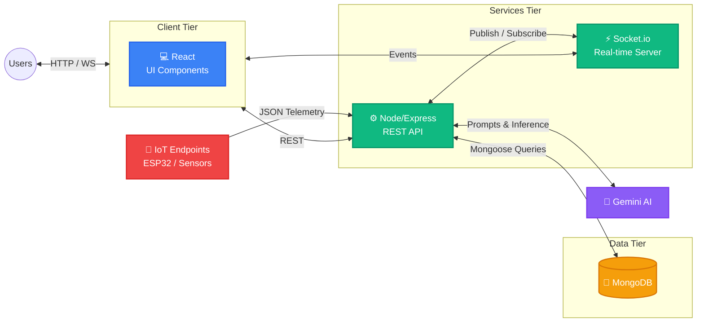

<div align="center">

# 🏙️ Smart City Command & Control Platform
**A Next-Generation AI & IoT Powered Governance Ecosystem for Modern Cities.**

[](https://mongodb.com)
[](https://reactjs.org/)
[](https://nodejs.org/)
[](https://socket.io/)
[](https://ai.google.dev/)

*⭐ If you find this project useful, please consider giving it a star! ⭐*

</div>

---


---

## 🧠 Problem → Solution

**The Problem:**
Rapid urbanization has outpaced the digital infrastructure of most cities. Fragmented systems, manual reporting flows, and isolated data silos lead to chaotic urban environments, delayed civic responses, and poor citizen satisfaction.

**The Gap:**
Existing solutions generally target either IoT *or* civic complaints, leaving decision-makers without a unified view to effectively manage metropolitan-scale operations.

**The Solution:**
Our **Smart City Command & Control Platform** bridges this gap by unifying human intelligence and machine telemetry. We empower citizens to seamlessly report issues, utilize AI to automatically categorize and prioritize complaints, and integrate live IoT data streams to offer a holistic, real-time command center for smart urban governance.

---

## ✨ Features

### 🏛️ Governance
- 📊 **Centralized Analytics Dashboard:** Real-time, bird's-eye view of city health and operations constraints.
- 👥 **Role-Based Workspaces (RBAC):** Strict structural isolation for Admins, Operators, and Citizens.
- 🏢 **Multi-Department Sync:** Streamlined collaboration and escalation tracking across administrative boundaries.

### 🏙️ Civic Modules
- 📝 **Incident Management System:** Frictionless reporting and tracking of urban infrastructure issues.
- 📑 **Smart Ticketing:** Automated routing and assignment of tasks to relevant functional operators.
- 📈 **SLA Monitoring:** Ensure absolute accountability with exact service level and resolution time tracking.

### 🧑‍🤝‍🧑 Citizen Experience
- 📱 **Intuitive Public Portal:** Clean, highly accessible interface for submitting specific grievances and issues.
- 🔔 **Instant Status Updates:** Live feedback loops on reported cases directly to the end user.
- 💬 **Transparent History:** Complete record-keeping of personal civic interactions and past service metrics.

### 🤖 AI & IoT
- 🧠 **Gemini AI Integration:** NLP-powered complaint summarization, autonomous categorization, and predictive maintenance insights.
- 🔌 **Dynamic IoT Ingestion:** Ready-to-scale endpoints managing live traffic, weather anomalies, and utility metrics matrices.
- 📡 **WebSockets Engine:** Low-latency, bidirectional Socket.io communication reflecting status changes precisely in milliseconds.

---

## 🏗️ Architecture



---

## ⚙️ Tech Stack

### Frontend
- React.js + Vite
- Tailwind CSS
- Context API / Redux for State Management
- Recharts

### Backend
- Node.js
- Express.js
- JSON Web Tokens (JWT)

### Database
- MongoDB
- Mongoose ORM

### AI
- Google Gemini API

### Realtime
- Socket.io

---

## 🔄 Workflow

1. **Complaint Creation:** A citizen encounters a civic issue (e.g., severe water logging) and logs it via our public portal interface.
2. **AI Processing:** Our Gemini integration analyzes the submission text/image, categorizes the severity context, and determines the targeted department automatically.
3. **Admin Assignment:** The parsed complaint lands on the Admin dashboard where it is instantly routed to an available assigned operator.
4. **Operator Resolution:** The operator accepts the ticket on their interface, resolves the issue on-site, and updates the status to *Resolved*.
5. **Real-time Update:** Socket.io instantly propagates this state change directly to the citizen's live view.

---

## 📡 IoT Section

Our platform natively supports highly scalable embedded endpoints for full city grid monitoring:
- **Device Registration:** Secure system provisioning endpoints for authenticating dedicated smart city infrastructure nodes.
- **Telemetry Flow:** Exceptionally robust data ingestion API natively built to digest high-frequency, concurrent metric data dumps.
- **Real-time Alerts:** Configurable condition thresholds that instantly trigger critical push warnings on the Control Dashboard.
- **Global Compatibility:** Fully tested out-of-the-box compatibility with lightweight REST payloads formatted via ESP32, ESP8266, or simulation nodes.

---

## 🛠️ Installation

**1. Clone the repository**
```bash
git clone https://github.com/SamarthKapdi/SmartCity_CodeStorm_Hackathon.git
cd SmartCity_CodeStorm_Hackathon
```

**2. Install dependencies**
```bash
# Install backend packages
cd backend
npm install

# Install frontend packages
cd ../frontend
npm install
```

**3. Environment Setup**
Create the necessary `.env` files in both the frontend and backend directories. Use the provided `.env.example` as a template for MongoDB URIs, JWT Secrets, and Gemini API keys.

**4. Run the application**
```bash
# Terminal 1: Start the backend server
cd backend
npm run dev

# Terminal 2: Start the frontend development environment
cd frontend
npm run dev
```

---

## 🔑 Demo Credentials

To explore the application natively without making accounts, utilize the following configured role instances:

| Role | Email | Password |
| :--- | :--- | :--- |
| **Admin** | `admin@smartcity.gov` | `admin123` |
| **Operator** | `operator@smartcity.gov` | `operator123` |
| **Citizen** | `citizen@mail.com` | `citizen123` |

---

## 📂 Project Structure

```text
📦 SmartCity_CodeStorm_Hackathon
 ┣ 📂 backend
 ┃ ┣ 📂 controllers
 ┃ ┣ 📂 middleware
 ┃ ┣ 📂 models
 ┃ ┣ 📂 routes
 ┃ ┣ 📂 services
 ┃ ┗ 📜 server.js
 ┣ 📂 frontend
 ┃ ┣ 📂 src
 ┃ ┃ ┣ 📂 assets
 ┃ ┃ ┣ 📂 components
 ┃ ┃ ┣ 📂 context
 ┃ ┃ ┣ 📂 hooks
 ┃ ┃ ┣ 📂 pages
 ┃ ┃ ┗ 📜 App.jsx
 ┣ 📂 assets             # README media and screenshots
 ┗ 📜 README.md
```

---

## 🔐 Security Architecture

- **JWT Auth:** Stateless, encrypted authentication token mechanism dynamically managing user sessions.
- **Granular RBAC:** Middleware-enforced permission checking to strictly ensure operators/citizens are scoped explicitly within their clearance constraints.
- **IoT Key System:** Hardened, dedicated IoT API key authentication eliminating bulk malicious data injection and structural payload spoofing.

---

## 📈 Future Scope

- **Smart Automation:** Expand autonomous capabilities by dynamically dispatching drone flights for visual assessments of reported civic faults.
- **ML Models:** Deployment of decentralized ML clusters acting directly on-edge for real-time intersection traffic density optimization and prediction.
- **Government Integration:** Future-ready integrations to sync verification systems natively with primary Federal/State Identifications (Aadhaar, Govt ID, etc.).

---

## 🏆 Why This Project?

**“We are building the future of smart governance.”**

This platform represents the core digital backbone required to lead the cities of tomorrow. It scales efficient administration, absolutely guarantees responsiveness, and fundamentally transforms the citizen-governance relationship standard. 

---

## 📜 License

This project is open-sourced under the **MIT License**.
